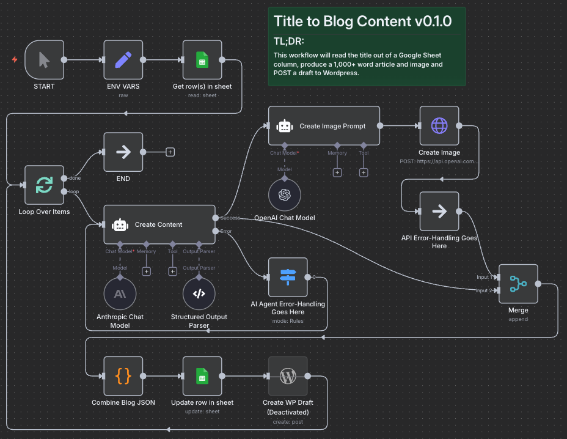

# Create A Blog Post With AI-generated Image All From A Title

An n8n workflow to create a 1,000 word article, complete with an AI-generated image and post it to Wordpress all from just an blog post title.

## Getting Started

### About This Code

A Proof-of-Concept n8n workflow created for Upwork Job ID 1947377009754348821.  You're welcome to use it however you'd like.

### Requirements

* An [n8n.io](n8n.io) account (or self-hosted)
* Google Sheet with the following column headers: Blog Title, Content, Image URL
* Anthropic API account (to use Sonnet 4)
* OpenAI API account (to use GPT Image 1)
* Wordpress API Key to create blog posts

### Instructions For Use

* Download title_to_blog_content.json and import it into your n8n workspace.

### Optional

* Define your own trigger: Manual, Scheduled, Triggered on new row
* Replace error-handling place-holders with actual error-handling.
* Retreive AI-generated image and store it on your own host OR update functionality to upload it to Wordpress

## Authors
* **Aaron Melton** - *Author* - Aaron Melton <aaron@ascendautomation.ai>
